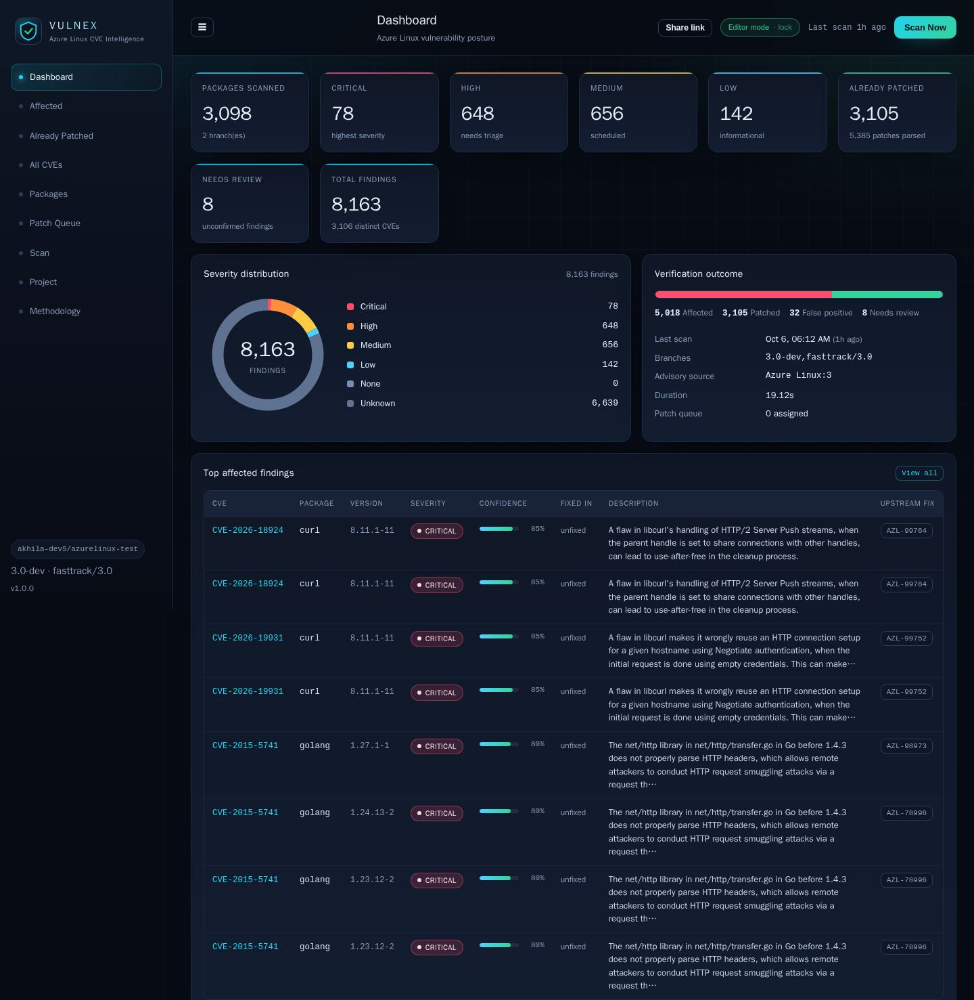
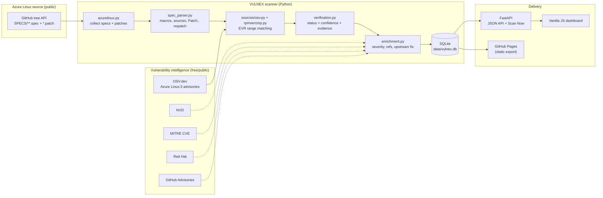
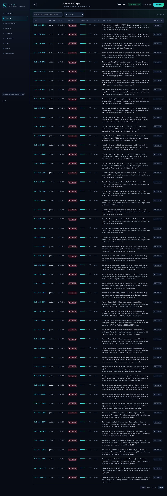
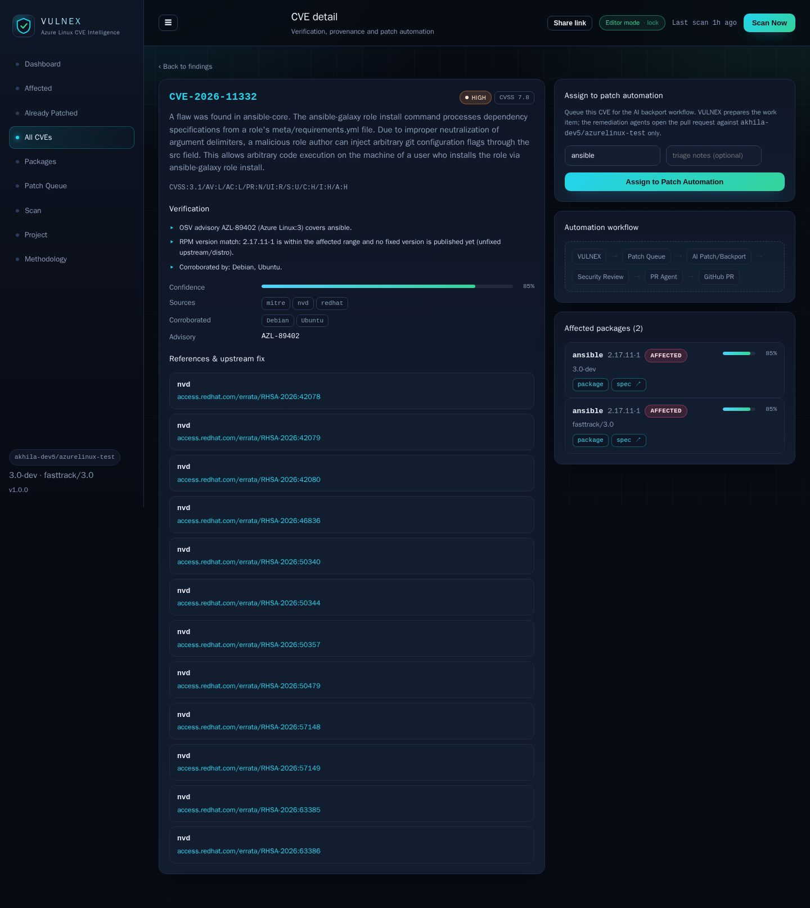
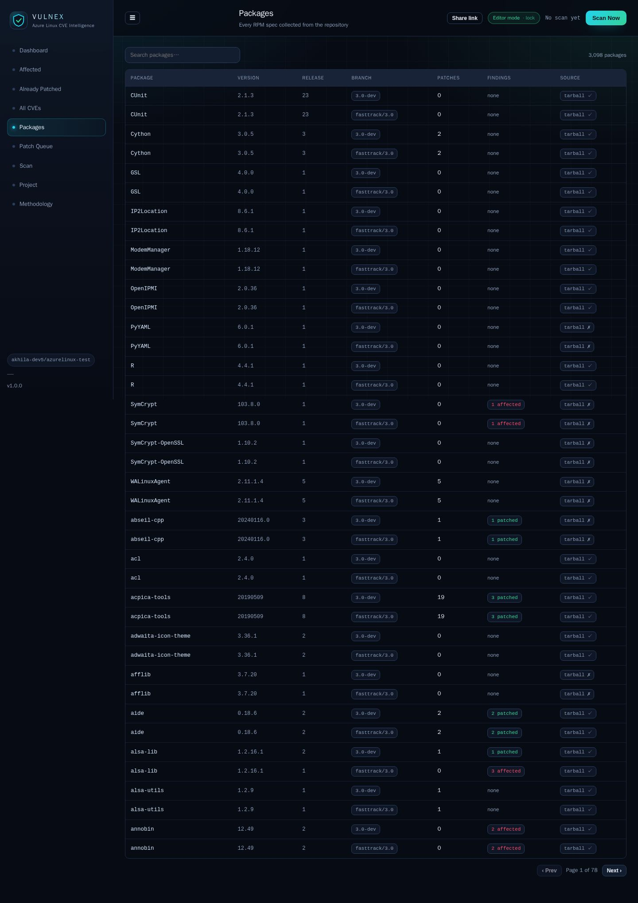
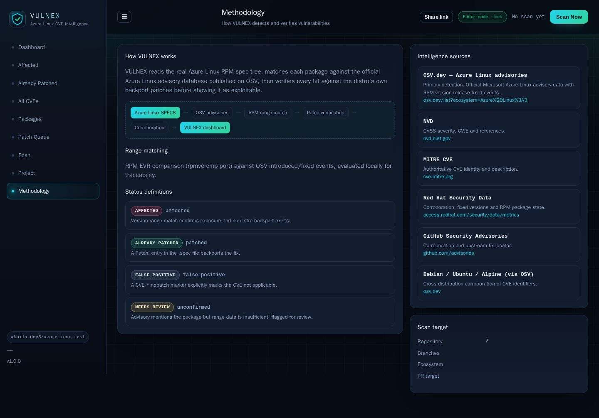
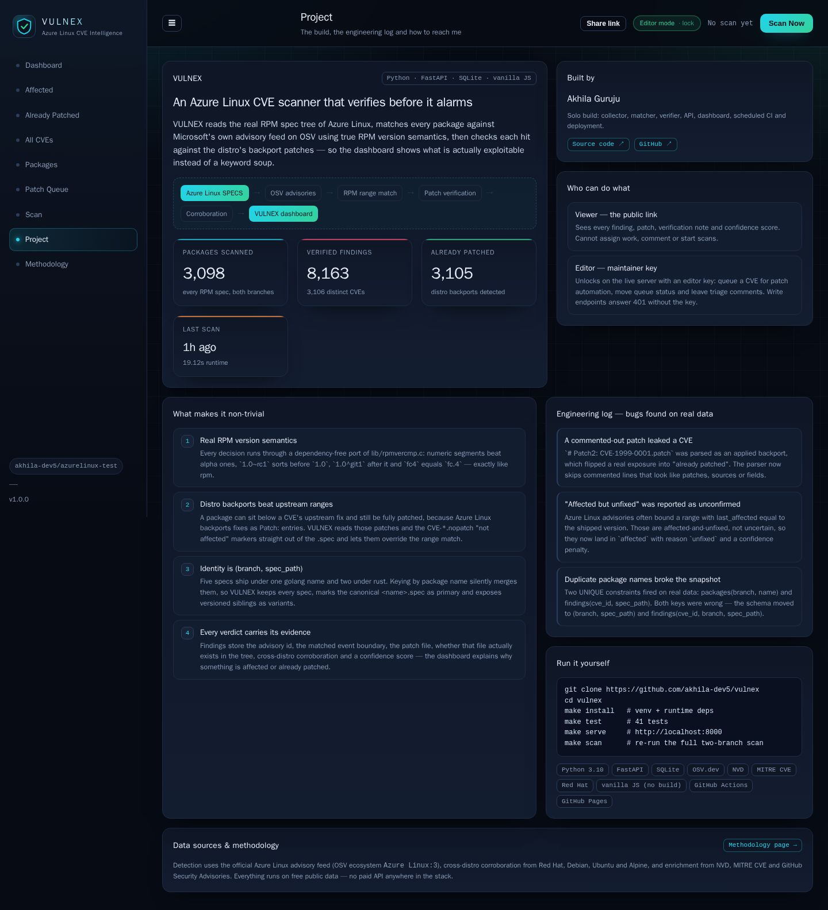

# VULNEX

**Azure Linux CVE scanner and security dashboard.** VULNEX reads the real RPM spec
tree of [Azure Linux](https://github.com/microsoft/azurelinux), matches every package
against the official Microsoft Azure Linux advisory database, and then *verifies* each
hit against the distro's own backport patches — so the dashboard shows what is actually
exploitable, not a keyword soup.

It runs entirely on free infrastructure: public vulnerability data, SQLite, a
dependency-light FastAPI service, a build-free frontend, GitHub Actions for the
scheduled scan, and GitHub Pages for the hosted dashboard.

```
Python 3.10+ · FastAPI · SQLite · build-free vanilla JS · GitHub Actions · GitHub Pages
```

<p align="center">
  
</p>

---

## Table of contents

- [What it does](#what-it-does)
- [This is not a keyword matcher](#this-is-not-a-keyword-matcher)
- [Architecture](#architecture)
- [Detection and verification methodology](#detection-and-verification-methodology)
- [Data sources](#data-sources)
- [Real scan results](#real-scan-results)
- [Quickstart](#quickstart)
- [CLI reference](#cli-reference)
- [API reference](#api-reference)
- [Dashboard tour](#dashboard-tour)
- [Sharing the dashboard and the two access tiers](#sharing-the-dashboard-and-the-two-access-tiers)
- [Scheduled scanning and GitHub Pages](#scheduled-scanning-and-github-pages)
- [Patch automation interface](#patch-automation-interface)
- [Tests](#tests)
- [Project structure](#project-structure)
- [Limitations and roadmap](#limitations-and-roadmap)
- [License](#license)

---

## What it does

- **Scans real package data.** Parses every `.spec` file from the Azure Linux
  branches `3.0-dev` and `fasttrack/3.0` directly from the GitHub tree API — package
  name, version, release, epoch, `.spec` path, `Source0`/`Source1` tarball URLs and
  every `Patch:` entry. Nothing is hard-coded; `data/vulnex.db` is a real snapshot.
- **Identifies CVEs with version-range logic.** Each package EVR
  (`[epoch:]version-release`) is compared against OSV advisory `introduced` / `fixed` /
  `last_affected` events using a dependency-free port of RPM's `rpmvercmp`
  (including the `~` and `^` separators).
- **Classifies instead of guessing.** Every CVE/package pair ends up as
  **Affected**, **Already Patched**, **False Positive** or **Unconfirmed**, each with a
  confidence score and human-readable evidence.
- **Shows patch provenance.** For each finding it knows the backport patch file, whether
  that file actually exists in the repo, whether it is a `*.nopatch` "not affected"
  marker, and (where available) the upstream fix commit and the files it touched.
- **Ships a security-ops dashboard** with totals, severity distribution, searchable
  tables and CVE detail pages.
- **Has a hand-off point for automated remediation.** "Assign to Patch Automation"
  queues a finding for a future AI backport agent; PRs are only ever opened against the
  configured Azure Linux test repository.

---

## This is not a keyword matcher

A naive scanner flags a package whenever a CVE mentions its name. That is useless: Azure
Linux backports fixes constantly, so a package can be "older than upstream's fix" and
still be completely patched.

VULNEX makes three independent checks agree before it calls something exploitable:

| Check | Question | Result |
| --- | --- | --- |
| RPM range match | Is the package's EVR inside the advisory's affected range? | `affected` / not |
| Distro backport | Does the spec apply a `Patch:` for this CVE? | `patched` |
| Explicit non-issue | Does the spec ship a `CVE-*.nopatch` marker? | `false_positive` |

A CVE only surfaces as an exposure when the version is in range **and** no distro
backport or nopatch marker overrides it. Otherwise it is reported as patched,
false-positive, or — when the data is genuinely insufficient — flagged as unconfirmed
for human review rather than silently dropped.

---

## Architecture



The scan pipeline, end to end:

```
1. collect    GitHub tree API -> 1549 .spec files per branch (single request, no clone)
2. parse      macros, Source0/1, Patch:N, CVE ids, *.nopatch, patch-file presence
3. match      POST /v1/query against OSV "Azure Linux:3" with each package EVR
4. verify     RPM range match + spec backports -> status, confidence, evidence
5. corroborate  cross-check CVE ids against Red Hat / Debian / Ubuntu / Alpine
6. enrich     NVD + MITRE + Red Hat + GHSA for severity, refs, upstream fix commits
7. persist    atomic snapshot swap into SQLite
```

An ASCII fallback of the same flow:

```
Azure Linux SPECS ──▶ parse ──▶ OSV advisory range match ──▶ verify ──▶ SQLite
                                    ▲                          ▲
                            rpmvercmp (EVR)           spec Patch:/nopatch
                                                              │
                        NVD · MITRE · Red Hat · GHSA  ◀────────┘  (enrichment)
```

---

## Detection and verification methodology

### 1. Package identity comes from the spec tree, not a package list

The scanner walks the repository tree for each branch, then parses each `.spec`:

- `Name`, `Version`, `Release`, `Epoch`, `Summary`, `License`, `URL`, `Group`
- RPM macro expansion (`%define` / `%global`, `%{name}`, `%{?dist}`, `%{!?x:y}`)
- `Source0` / `Source1` … → tarball name, upstream URL, and the Azure Linux blob-store URL
- `Patch0..N` → patch file, CVE ids in the filename or trailing comment, and whether the
  file actually exists in the repo

The package identity is `(branch, spec_path)`. That matters: `golang` ships as
`golang.spec` **and** `golang-1.23.spec` … `golang-1.26.spec`, and `rust` as `rust.spec`
and `rust-1.75.spec`. A name-based model silently collapses those; VULNEX keeps every
spec and marks the canonical one (`<name>.spec`) as primary. The same `spec_path` exists
on both branches, so branch is always part of the key.

### 2. Version-range matching with real RPM semantics

OSV publishes the official Microsoft Azure Linux advisory database under the ecosystem
**`Azure Linux:3`**, imported from `microsoft/AzureLinuxVulnerabilityData`. Its
advisories (`AZL-####`) carry RPM `fixed` / `last_affected` boundaries:

```json
"affected": [{
  "package": { "name": "zlib", "ecosystem": "Azure Linux:3" },
  "ranges": [{ "type": "ECOSYSTEM",
               "events": [{ "introduced": "0" }, { "fixed": "1.3.1-1" }] }]
}]
```

VULNEX evaluates those events locally with `rpmvercmp.py`, a faithful port of
`lib/rpmvercmp.c`:

- numeric segments beat alpha segments, leading zeros are ignored
- `~` sorts *before* the base version (`1.0~rc1 < 1.0`)
- `^` sorts *after* it (`1.0^git1 > 1.0`)
- `fc4` equals `fc.4`, `1.05` equals `1.5`

Azure Linux advisories frequently scope a range with `last_affected` equal to the shipped
version — meaning *affected and still unfixed*. Those are classified as **affected** with
the reason `unfixed` (not as unconfirmed), which is the accurate reading.

### 3. Distro backports override the range match

If the `.spec` applies a `Patch:` that carries the CVE in its name or comment, the package
is **patched** for that CVE regardless of what any upstream version range says — this is
exactly what a distro backport means. Confidence gets a bonus when the patch file is
actually present in the tree, and a penalty when a declared patch file is missing.

A `CVE-*.nopatch` marker means Azure Linux explicitly assessed the CVE as *not
applicable* → **false positive**.

### 4. Confidence and evidence

| Status | Base confidence | Signals |
| --- | --- | --- |
| `false_positive` | 0.92 | explicit `.nopatch` marker |
| `patched` | 0.90 | `Patch:` backport, bonus if the file exists |
| `affected` | 0.75 | range match, bonus for cross-distro corroboration, penalty if unfixed |
| `unconfirmed` | 0.40 | advisory mentions the package, no usable range |

Every finding stores the evidence strings, the advisory id, the patch name/status, the
corroborating sources and the raw source list, so the dashboard can explain *why* a
verdict was reached instead of asserting it.

Two real examples from the current snapshot:

- **`curl` 8.11.1-11** → `Patch0..Patch22` name CVEs such as `CVE-2025-0665` and
  `CVE-2026-1965`, so those are **Already Patched**; the 7 CVEs without a backport are
  **Affected**.
- **`sqlite` 3.44.0-4** → `Patch0: CVE-2015-3717.nopatch` (explicitly not affected →
  False Positive) plus three CVE backports (Already Patched).

---

## Data sources

| Source | Used for | Cost |
| --- | --- | --- |
| **OSV.dev — `Azure Linux:3`** | Primary detection: official Azure Linux advisories with RPM `fixed`/`last_affected` events | free |
| **OSV.dev — Red Hat / Debian / Ubuntu / Alpine** | Cross-distribution corroboration of CVE ids | free |
| **NVD** | CVSS severity, CWE, references | free (optional `NVD_API_KEY` raises limits) |
| **MITRE CVE (cveawg)** | Authoritative CVE identity and description | free |
| **Red Hat Security Data API** | Severity, fixed versions, `package_state` | free |
| **GitHub Security Advisories** | Corroboration and upstream-fix discovery | free |
| **GitHub tree/raw API** | Spec + patch collection | free (uses `GITHUB_TOKEN` in CI) |

No OpenAI/Anthropic/AWS/Azure billing is involved anywhere.

---

## Real scan results

Current committed snapshot (`data/vulnex.db`), branches `3.0-dev` + `fasttrack/3.0`:

| Metric | Value |
| --- | --- |
| Packages scanned | **3,098** (1,549 specs × 2 branches) |
| Findings | **8,163** |
| Distinct CVEs referenced | **3,106** |
| Affected | 5,018 |
| Already patched | 3,105 |
| False positive (`.nopatch`) | 32 |
| Unconfirmed | 8 |
| Patch entries parsed | 5,385 |
| Critical / High / Medium / Low | 78 / 648 / 656 / 142 |
| Cold scan time | ~2 min (warm cache ~20 s) |

> Severity is populated from advisory CVSS data and then enriched from
> NVD / Red Hat / GHSA for the highest-signal findings. Findings that were not enriched
> yet report `unknown` rather than inventing a score. The enrichment cap is configurable
> (`--enrich-limit`, default 400 in the scheduled workflow).

---

## Quickstart

Requires **Python 3.10+**. No Node, no build step, no database server.

```bash
git clone https://github.com/akhila-dev5/vulnex.git
cd vulnex

make install            # creates backend/.venv and installs runtime + dev deps
make test               # 41 tests
make serve              # http://localhost:8000  (live dashboard + Scan Now)
```

Prefer to do it by hand:

```bash
python3 -m venv backend/.venv
backend/.venv/bin/python -m pip install -r backend/requirements-dev.txt

cd backend
python -m pytest -q                       # test suite
python -m vulnex.cli scan                 # full scan of both branches
python -m vulnex.cli stats                # dashboard totals as JSON
python -m vulnex.cli serve --port 8000    # live API + dashboard
```

A scan needs no credentials. If `GITHUB_TOKEN` / `GH_TOKEN` is set (GitHub Actions sets
one automatically, and locally VULNEX falls back to `gh auth token`) the GitHub calls use
it for a higher rate limit; otherwise collection just runs unauthenticated.

### Scanning a subset quickly

```bash
cd backend
python -m vulnex.cli scan --packages curl,openssl,zlib,sqlite --branches 3.0-dev --no-enrich
```

### Building the static dashboard locally

```bash
cd backend && python -m vulnex.cli export --out ../site
python -m http.server -d ../site 8080     # http://localhost:8080
```

---

## CLI reference

```
vulnex scan     Run a scan and replace the SQLite snapshot
  --branches 3.0-dev,fasttrack/3.0     branches to scan (env VULNEX_BRANCHES)
  --packages curl,openssl              restrict to a package allow-list
  --limit N                            cap the number of specs (0 = all)
  --ecosystem "Azure Linux:3"          OSV ecosystem to query
  --enrich-limit N                     max CVEs to enrich (default 400)
  --no-blobs                           skip blob-store tarball verification
  --no-corroborate                     skip cross-distro corroboration
  --no-enrich                          skip NVD/MITRE/Red Hat/GHSA enrichment

vulnex stats    Print dashboard totals as JSON
vulnex serve    Serve the JSON API + dashboard (--host, --port, --db)
vulnex export   Write the static GitHub Pages dashboard + JSON snapshot (--out)
```

---

## API reference

| Method | Path | Description |
| --- | --- | --- |
| `GET` | `/api/health` | Liveness + version |
| `GET` | `/api/stats` | Totals, severity split, last scan, repository config |
| `GET` | `/api/packages` | Paged package list (`search`, `branch`, `page`, `limit`) |
| `GET` | `/api/packages/{name}` | Package detail incl. patches, findings and spec variants (`branch`, `spec`) |
| `GET` | `/api/findings` | Paged findings (`status`, `severity`, `search`, `package`, `branch`) |
| `GET` | `/api/cves/{cve_id}` | All findings for a CVE + live enrichment (`?enrich=false` to skip) |
| `GET` | `/api/role` | Access tier for the caller (`viewer` / `editor`), from the presented editor key |
| `GET` | `/api/assignments` | Patch-automation queue with its triage comments |
| `POST` | `/api/assignments` | Editor only — queue a finding (`cve_id`, `package_name`, `spec_path?`, `notes`) |
| `PATCH` | `/api/assignments/{id}` | Editor only — update queue status (`?status=`) |
| `POST` | `/api/assignments/{id}/comments` | Editor only — add a triage comment (`body`) |
| `POST` | `/api/scan` | Editor only — start a scan in the background (`202`, `409` if busy, `401` for viewers) |
| `GET` | `/api/scan/status` | Live scan progress log + last scan |
| `GET` | `/api/scans` | Scan history |
| `GET` | `/api/methodology` | Machine-readable methodology (powers the Methodology page) |

Interactive docs are at `http://localhost:8000/docs` when `vulnex serve` is running.

---

## Dashboard tour

| Dashboard | Affected packages |
| --- | --- |
|  |  |

| CVE detail + patch automation | Packages |
| --- | --- |
|  |  |

| Methodology | Project (portfolio view) |
| --- | --- |
|  |  |

Views: **Dashboard** (KPIs, severity donut, verification outcome, last scan),
**Affected** / **Already Patched** / **All CVEs** (searchable, filterable, paged tables),
**Packages** (every spec, with source-tarball availability), **Package detail** (sources,
patches, affected/patched CVEs, spec variants), **CVE detail** (verification evidence,
references, "Assign to Patch Automation"), **Patch Queue**, **Scan** (Scan Now + history),
**Project** (the build, its engineering log and the author card), **Methodology**.

Regenerate the screenshots with:

```bash
pip install playwright && python -m playwright install chromium
make screenshots        # writes docs/screenshots/*.jpg
```

---

## Sharing the dashboard and the two access tiers

One dashboard, two audiences. Visitors get a read-only showcase; the maintainer
gets an editor workspace.

| | **Viewer** — the link you share | **Editor** — you |
| --- | --- | --- |
| How it runs | the static export (`site/`, GitHub Pages) or any live server with `VULNEX_EDITOR_KEY` set | `vulnex serve` with the editor key |
| Can read | every finding, patch, verification note, confidence score, queue and triage trail | same |
| Can write | nothing — the hosted copy is a static snapshot with no backend | assign CVEs to patch automation, move queue status, leave triage comments, start scans |
| Enforcement | `staticApi()` refuses every non-GET; no server exists to write to | every write endpoint answers `401` without `X-VULNEX-Key` |

**How to share it with recruiters, interviewers or a team.**

1. **Static showcase (recommended).** `make export` builds `site/`, and the scheduled
   workflow publishes it to GitHub Pages — a free, permanent link anyone can open
   without an account. This is the read-only tier by construction: `window.VULNEX_STATIC`
   is baked with `role: "viewer"`, the header shows *Read-only view* and the assign /
   comment / scan controls are not rendered at all.
2. **Live server.** `make serve` gives the full interactive app on `:8000`. Every write
   needs the editor key:

   ```bash
   VULNEX_EDITOR_KEY='pick-a-long-passphrase' \
     python -m vulnex.cli serve --host 0.0.0.0 --port 8000
   ```

   Without the key the server stays in local *open editor* mode so development is never
   blocked — set the key before exposing a live server to anyone else. In the UI, click
   the red *Read-only view* chip, paste the key, and the header flips to *Editor mode*;
   the key is kept in `localStorage` and sent as an `X-VULNEX-Key` header.
3. **Share link button.** The `Share link` button in the header copies the current view
   (including its hash route) so you can hand someone the exact CVE or package you are
   talking about.

Portfolio metadata for the **Project** page comes from the environment, so nothing is
claimed on the author's behalf:

| Variable | Default | Used for |
| --- | --- | --- |
| `VULNEX_AUTHOR_NAME` | `Akhila Guruju` | the "Built by" card |
| `VULNEX_AUTHOR_GITHUB` | `https://github.com/<repo owner>` | GitHub link |
| `VULNEX_AUTHOR_URL` | *(empty)* | personal site / profile link, hidden when unset |
| `VULNEX_AUTHOR_TAGLINE` | *(empty)* | one-line role line, hidden when unset |
| `VULNEX_PROJECT_REPO` | `akhila-dev5/vulnex` | "Source code" link and the `git clone` line |
| `VULNEX_DEMO_URL` | *(empty)* | "Live demo" link, hidden when unset |

---

## Scheduled scanning and GitHub Pages

`.github/workflows/scan.yml` runs daily at 06:17 UTC (and on manual dispatch):

1. **test** — installs dev deps and runs `pytest` (nothing ships if a test fails).
2. **scan** — runs the full two-branch scan, prints `vulnex stats`, builds the static
   dashboard with `vulnex export`, and commits the refreshed `data/vulnex.db` back to
   `main` (`[skip ci]`, so the workflow can never loop on itself).
3. **deploy** — publishes the exported dashboard to **GitHub Pages**.

To enable the hosted demo once in your repository: **Settings → Pages → Build and
deployment → Source: GitHub Actions**, then run the workflow. The dashboard will be live
at `https://<owner>.github.io/vulnex/`.

The Pages build runs the same SPA with `window.VULNEX_STATIC` set, so it answers every
API call from a pre-baked JSON snapshot in `site/api/` — filtering, sorting and
pagination all happen in the browser, with no backend at all. Optional `NVD_API_KEY`
secret raises NVD rate limits; everything else works with the default `GITHUB_TOKEN`.

---

## Patch automation interface

VULNEX deliberately stops at *preparing* work; it does not open pull requests itself.

The **Assign to Patch Automation** action on a CVE detail page writes a record to the
`assignments` table (`queued` → `in_progress` → `done`), returned by
`POST /api/assignments` together with the workflow it feeds:

```
VULNEX → Patch Queue → AI Patch/Backport Agent → Security Review Agent → PR Agent → GitHub PR
```

`data/vulnex.db` and the JSON API are the contract: a remediation agent picks up queued
items, and **PRs are only ever opened against the configured target repository**
(`VULNEX_PATCH_TARGET_REPO`, default `akhila-dev5/azurelinux-test`).

---

## Tests

```bash
cd backend && python -m pytest -q     # 41 passed
```

| File | Covers |
| --- | --- |
| `tests/test_rpmvercmp.py` | EVR comparison, `~` / `^`, separators, case, epoch |
| `tests/test_spec_parser.py` | macro expansion, CVE extraction, commented-out patches, `.nopatch`, patch-file presence |
| `tests/test_verification.py` | status precedence, backport overriding OSV, corroboration, Azure Linux `last_affected` semantics |
| `tests/test_api.py` | API surface, snapshot identity across duplicate package names, assignment flow, static frontend serving |
| `tests/test_export.py` | static Pages export: static flag injection, rehydrated references, finding counts, scan history |
| `tests/test_access.py` | access tiers: viewers get 401 on every write, editors can assign/comment, open mode without a key |

The suite runs against fixtures and never touches the network.

---

## Project structure

```
vulnex/
├── backend/
│   ├── vulnex/
│   │   ├── azurelinux.py     GitHub tree/raw collection + blob-store checks
│   │   ├── spec_parser.py    RPM spec parsing (macros, sources, patches)
│   │   ├── rpmvercmp.py      RPM EVR comparison port
│   │   ├── cvss.py           CVSS v3.0/v3.1 base-score maths
│   │   ├── sources/          osv · nvd · mitre · redhat · ghsa clients
│   │   ├── verification.py   status, confidence and evidence
│   │   ├── enrichment.py     severity / refs / upstream-fix resolution
│   │   ├── scanner.py        the 7-stage scan pipeline
│   │   ├── db.py             SQLite schema and queries
│   │   ├── export.py         static GitHub Pages export
│   │   ├── api.py            FastAPI app + Scan Now manager
│   │   └── cli.py            `vulnex` command line
│   ├── tests/                33 pytest tests
│   ├── requirements.txt      runtime deps (fastapi, uvicorn, requests, pydantic)
│   └── requirements-dev.txt  + pytest, httpx
├── frontend/                 build-free SPA (index.html, styles.css, app.js)
├── data/vulnex.db            committed scan snapshot (data/cache/ is gitignored)
├── docs/screenshots/         dashboard screenshots
├── scripts/screenshots.py    reproducible screenshot capture
├── .github/workflows/scan.yml  scheduled scan + Pages deploy
└── Makefile
```

---

## Limitations and roadmap

- **Severity coverage.** Findings only get a CVSS score when OSV, Red Hat, NVD, GHSA or
  MITRE provides one, and enrichment is capped per run. Unenriched findings report
  `unknown` on purpose.
- **Blob verification is best-effort.** Azure Linux serves release tarballs from a public
  blob store; VULNEX checks availability with `HEAD` requests and reports `tarball ✓/✗`
  rather than downloading multi-gigabyte archives.
- **Cross-branch duplication is intentional.** The same spec on two branches is two
  package rows, because a fix can land on one branch and not the other. Findings are
  keyed by `(cve_id, branch, spec_path)`.
- **Roadmap:** backport feasibility hints (does the patch apply?), historical trend charts
  across scheduled scans, and an opt-in agent that consumes the patch queue.

## License

MIT — see [LICENSE](LICENSE).

VULNEX correlates public advisory data and repository metadata. It is an
reconnaissance and triage aid, not a guarantee of security posture; always confirm
findings before acting on them.
